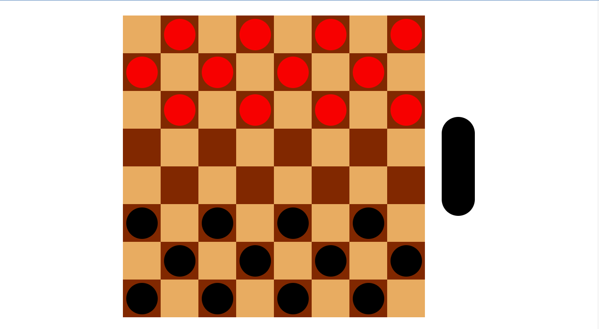

# Checkers 🔴⚫

</img>

The Checkers game was made by first planning out the different components a checkers game is composed of. 
 
A typical checkers game consists of a 8x8 board and the checker pieces (usually black and red and 12 each). 
Diving even deeper, the 8x8 board is made up of squares which can hold a checker piece, aka a "player" on the board. 
 

