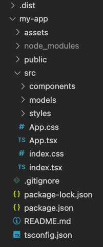
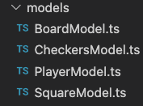
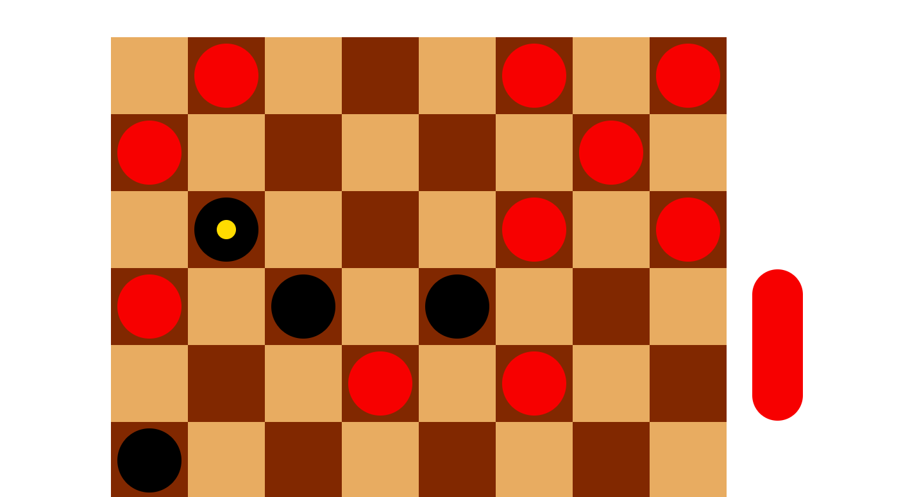
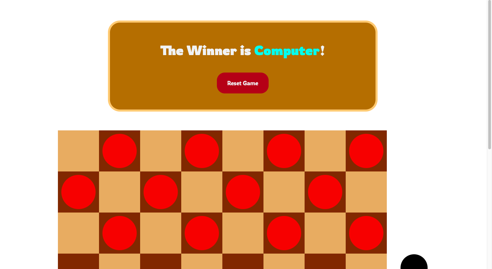
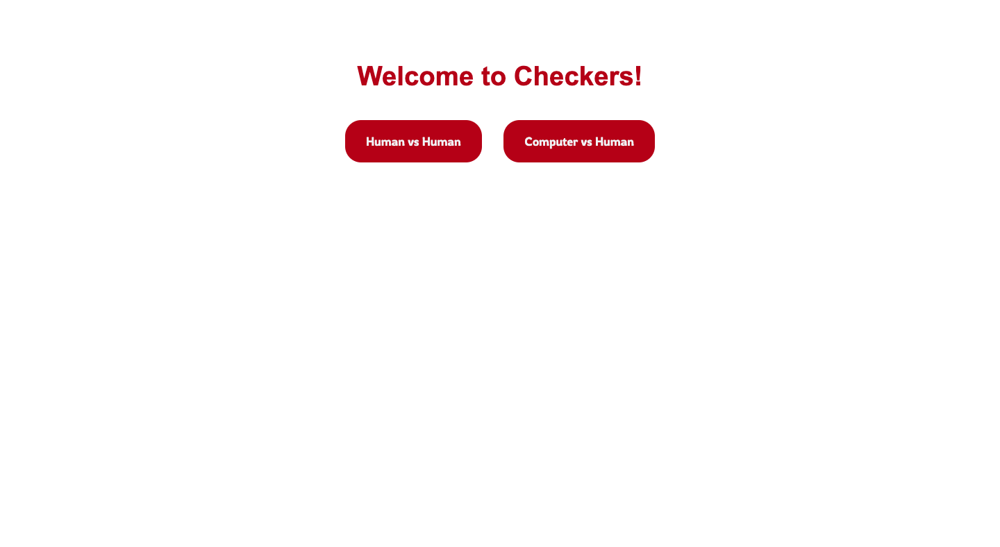

# Checkers 🔴⚫

</img>

The Checkers game was made by first planning out the different components a checkers game is composed of. 
<br>
A typical checkers game consists of a 8x8 board and the checker pieces (usually black and red and 12 each).<br>
Diving even deeper, the 8x8 board is made up of squares which can hold a checker piece, aka a "player" on the board. 
<br>

## File Breakdown
</img>

- /assets -> contain the general images of the entire project, all of which are for the readme only
- src/components -> stores the UI component files, the building blocks of any react project
- src/models -> store the object classes and functionality that powers the game
- src/styles -> CSS files for styling used in the components

## Models

</img>

I approached this project with a more object oriented approach. I first thought of the different classes and objects that were required and there respective properties. 

<br>

I first thought of the board. Each board is made up of squares and each square can hold a player. <br>
Thus, in the ```BoardModel.ts``` file there is a ```BoardModel``` class with a property called ```board``` which is a multidimensional array of Square (```SquareModel```) objects. <br><br>
In the ```SquareModel.ts``` file I there is a ```SquareModel``` class 🟫 which contains the properties ```row```, ```column```, ```width```, ```height```, ```empty```, ```square_color```, and ```player```. Since I was approaching this game with a multidimensional array, I made sure that each square object required a designated row and column position to easily locate any square through the board multidimensional array. <br> As well I required a player so that each square carries a Player (PlayerModel) object. Since I am basically now adding a player to every square on the board, I need to distinguish the difference between which square actually have players and which are empty. Lastly, I added a "empty" property which made sure to distinguish whether a square was actually empty or contained a player. <br><br>
The ```PlayerModel.ts``` file contains the ```PlayerModel``` class with the properties; ```color```, ```width```, ```height```, ```isComputer```, and ```special```. isComputer is a property which allows to distinguish between the human players and computer players / checker pieces on the board. And the property special is in the occasion when a checkers piece reaches the opposite side of the board and becomes a "king/dual threat" piece. 👑
<br><br>
Lastly, there is the ```CheckersModel.ts``` file which contains the ```CheckersModel``` class. This does not have a constructor or any attributes but rather a function called ```createBoard``` that starts the game by creating a multidimensional array of squares. 

Codesnippet inside the ```createBoard``` function
```
        let player_board = [["-", "r", "-", "r", "-", "r", "-", "r"],
                            ["r", "-", "r", "-", "r", "-", "r", "-"],
                            ["-", "r", "-", "r", "-", "r", "-", "r"],
                            ["-", "-", "-", "-", "-", "-", "-", "-"],
                            ["-", "-", "-", "-", "-", "-", "-", "-"],
                            ["b", "-", "b", "-", "b", "-", "b", "-"],
                            ["-", "b", "-", "b", "-", "b", "-", "b"],
                            ["b", "-", "b", "-", "b", "-", "b", "-"]];
        let color_board = [["s", "b", "s", "b", "s", "b", "s", "b"],
                           ["b", "s", "b", "s", "b", "s", "b", "s"],
                           ["s", "b", "s", "b", "s", "b", "s", "b"],
                           ["b", "s", "b", "s", "b", "s", "b", "s"],
                           ["s", "b", "s", "b", "s", "b", "s", "b"],
                           ["b", "s", "b", "s", "b", "s", "b", "s"],
                           ["s", "b", "s", "b", "s", "b", "s", "b"],
                           ["b", "s", "b", "s", "b", "s", "b", "s"]];
```
While populating the multidimensional array I made it so that it would already know what to do for every square. Above are two pre-made arrays. The ```player_board``` array contains the position of the black and red pieces/players and are distinguished by different letters. ```The color_board``` contains the actual color of each square on the board which is light brown and dark brown. creating the board this way was probably the easiest and more efficient way rather than trying to figure out a way to calculate what goes where. Simply modelling it after two other arrays. 🏁

<br>

## App.tsx

This is where the board component is rendered and the checkers ```board``` is created via the ```createBoard``` function in the ```CheckersModel``` class. the board, mode, and winner are all passed in the Board component. ```mode``` being the selected mode with a type string "Human" or if your facing the computer, "Computer." Winner is set to nobody so it is an empty string "". 

<br>

## Board.tsx

It is the main component file. To render the board it makes use of the ```Square``` component in the ```Square.tsx``` file to render each square based on the ```board``` prop array passed in. 

There is a ```startX```, ```startY```, ```changingX``` and ```changingY``` ```useState``` and a ```drop``` ```useState```. These are all used to track the users behaviour while playing checkers. These are all passed in the ```Square``` component and whenever a user drags and drops which is recorded in the ```Square``` component, the ```startX```, ```startY``` and ```changingX``` and ```changingY``` positions are all recorded as well as the ```drop```, to confirm a possible move. 

<br>

## BoardModel.ts

The BoardModel.ts is the main file and engine that powers the game. It handles the taking of turns functionality as well as calculating moves of both humans and computers. <br>

There is a ```possibleMove``` function which checks every time a person drags and drops a piece. This function valids whether or not the move was valid and returns a boolean. If it was valid, it updates the position of the piece in the array which then triggers a rerendering of the board through a ```useEffect```. <br>

Throughout the entirety of the project I make use of ```useState``` and ```useEffect``` a lot. I use ```useEffect``` for the rerendering of the board if it detect any changes and I use ```useState``` to switch the turn of the player (true representing a Human turn and false representing the opponents/computers turn), and for the drag and drop functionality to detect whether or not a user dragged and dropped a checker piece. ✅ <br>

<br>

## Square.ts

I was aware of a react drag and drop library but decided to not use it in an effort to try and recreate it myself and to also challenge myself. I did this by using HTML's ```handleDragStart```, ```handleDragOver```, and ```handleDragEnd``` hooked up to a useState which detected and set whether or not a square was bein dragged and dropped. 

<br>

## The Computer generated Moves

I developed a simple algorithm located in BoardModel.ts in the ```makeComputerMove```. It first checks if any of computer checker pieces can attack (red pieces), or take over a black piece. If not then it will advance starting from the backmost. So if there is a back piece that hasn't been moved, it will move that first. This is so that it can build up attacks or protect foward peices from being eaten

<br>

## More Examples:

- King Piece: indicated by golden dot
</img>

<br>
- Winner!
</img>

<br>
- Game Screen
</img>
<!-- ## Things I am Proud of

- No libraries were used
- Built my own drag and drop functionality from scratch without the use of any libraries 🖱️
- Exceeded requirements by building homescreen and the innovative touch of color changing taking of turns 💡
- Added human vs human and not just Computer  

<br>

## Potential improvements

- Definetly the decision making of the computer player. I am not a master at checkers and could have improved on making more robust decisions and a more thought-out decision tree. 🤖

<br>

## Final Thoughts

I very much enjoyed building out this entire project. I love these type of frontend projects because they help brush up my frontend skills and allow me to build a game that I can visually see. Completed in 5 days. 💙 -->